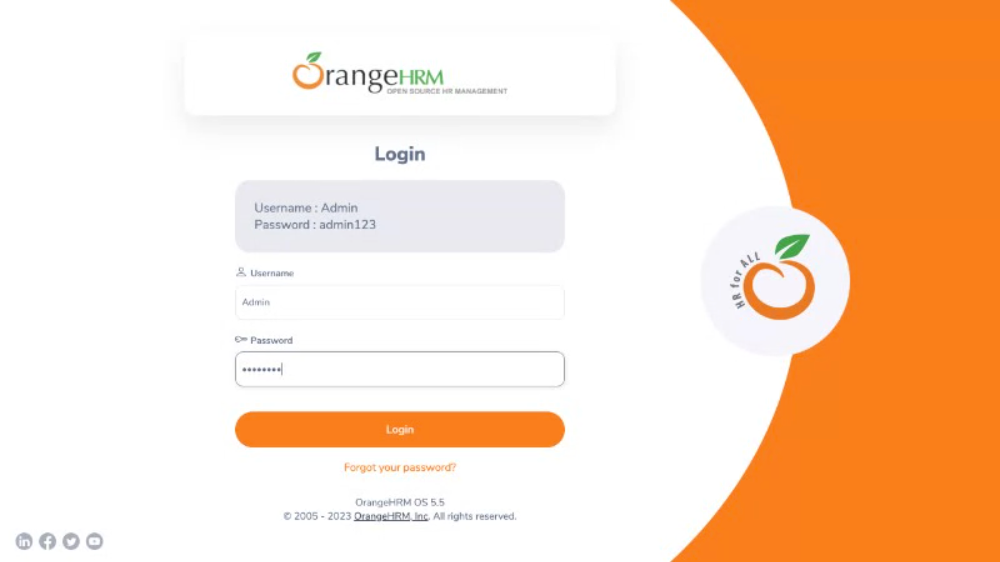

# e2e-playground
This project is a playground to practice e2e tests.

The [OrangeHRM](https://opensource-demo.orangehrmlive.com/) project has been used.

## Setup Pre-Requisites

Node.js v.18.17.0 +

npm 9.6.0 +

## Installation
1. Clone a project locally:
```
git@github.com:elfro/e2e-playground.git
```
2. Switch to project directory:
```
cd e2e-playground
```
3. Install packages:
```
npm ci
```
4. Install browsers
```
npx playwright install
```
5. Copy .env.example file to the root of the project with .env name.
6. Set `USERNAME` and `PASSWORD` values by copying them from the main auth page of [OrangeHRM](https://opensource-demo.orangehrmlive.com/) app.

7. Run tests:
```
npm run test-pw
```
8. View HTML report:
```
npx playwright show-report
```

___
## Tech Stack
- Programming language: [TypeScript](https://www.typescriptlang.org/); 
- Test library: [Playwright](https://playwright.dev/);
- To generate test data: [Faker](https://fakerjs.dev/);
- To check code syntax and style: [ESLint](https://eslint.org/), [Prettier](https://prettier.io/);
- CI: [GitHub Actions](https://docs.github.com/en/actions).

___

## Project Structure
### <a name="terminology"></a> Terminology

**Spec** file contains the test itself.

**Component** class usually contains all element selectors and methods to interact with those elements inside this component.

**Page** class consists of Components and may contain a method for page action that requires the work with several components.

**Client** provides the API with the specific external library / service that can be used in the tests.

**Helper** does general tasks that could be useful in different places. The most common representatives are:
- WebElementHelper: all basic Element actions are defined here;

**Data** stores necessary data and represents the proxy to pass that data between steps, or classes.

**Constants**, **Enum** use to represent the single or group of constants.

___

[](docs/assets/login-setup/video.webm)